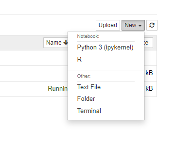

# statisticka_analyza_dat_cviceni / Statistical data analysis

## Install miniconda
https://docs.conda.io/en/latest/miniconda.html
 
### Create conda enviroment
conda create -n statistcs notebook
##### install R
conda install -c conda-forge r-base
##### install R irkernel
conda install -c r r-irkernel
 
 
conda activate statistics
 
write <jupyter notebook> into commandline to run the notebook 

